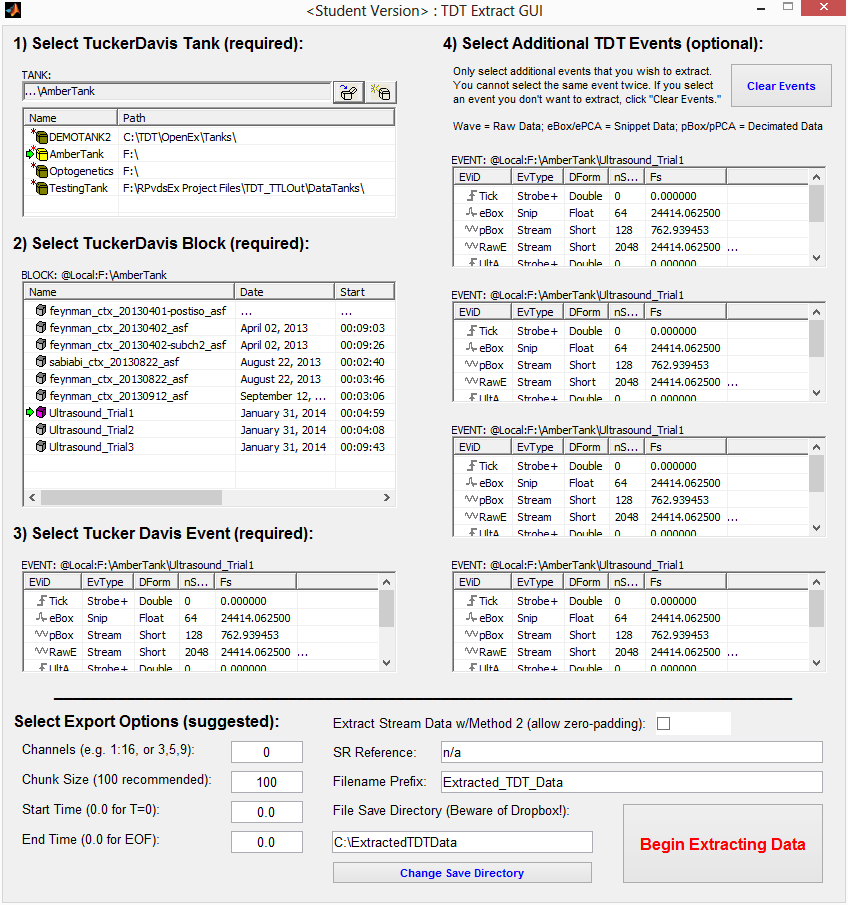

## TDT-Extraction-Sandbox-GUI

Data extraction tools / GUI in MATLAB for wrangling neuro/electrophys data stored in TDT (TuckerDavis Technologies) tank format.

### Instructions for Data Extraction

1. This can be used to extract data saved in the Tucker Davis proprietary tank format – you MUST have OpenDeveloper installed for this code to work. Tested with various MATLAB versions, including 2012/2013/2014 (Student Edition).
2. OpenDeveloper can be acquired from TDT: http://www.tdt.com/downloads.html
3. This works via ActiveX calls, so if you’ve disabled those on the operating system side, you’ll have errors.
4. Data extracted relative to a specific tank is useful if you want Epoch Data to match recording data timestamps.
5. If you try to extract anything from an empty store (e.g. if you try to extract an epoch that was never triggered) the extraction will fail; this is a bug that will be fixed.. someday.
6. There are better and faster ways of doing this, but this was a quick hack that ended up seeing far more use than I expected.
